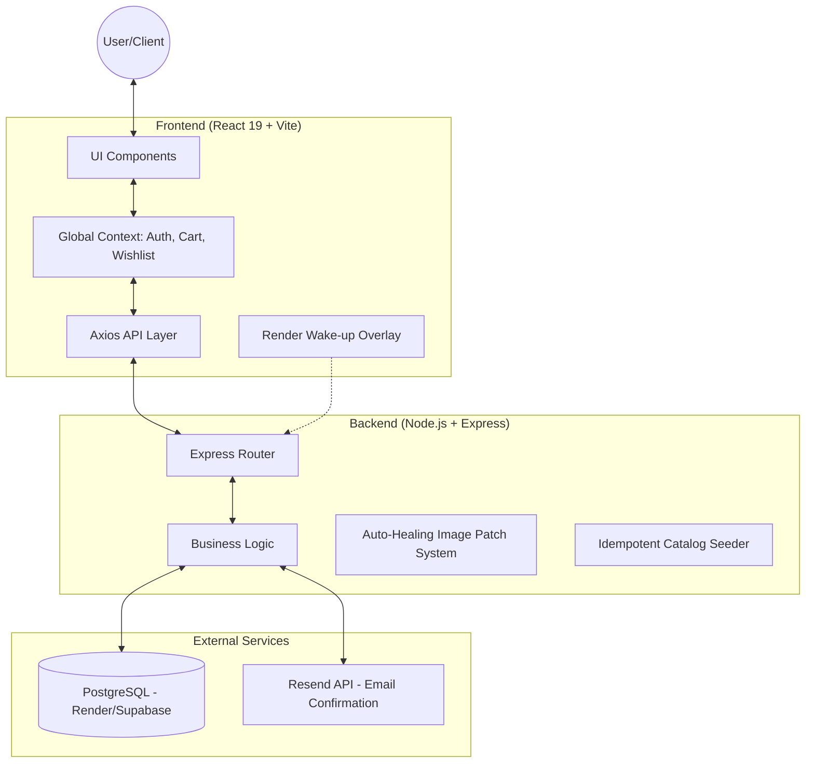

# Amazon Clone - Full Stack E-Commerce Solution

A high-performance, production-ready Amazon clone designed to replicate the primary experience of Amazon.in. This application delivers a complete end-to-end shopping journey, featuring advanced global state management, real-time synchronization, and a premium UI/UX.

---

## CRITICAL: Backend Activation Required

This project uses Render for backend hosting on a free tier. To ensure the application functions correctly:

1.  Always Wake the Backend: Before first use, the Render service must be initialized. 
2.  Activation Pop-up: A dedicated "Activate Server" overlay is located at the bottom right of the interface. 
    - Click it to redirect to the backend health-check page.
    - Once the "Thank you for waking me up!" message appears, return to the shop.
    - The overlay will automatically hide for 15 minutes after a successful activation to ensure a seamless shopping experience.

---

## System Architecture

The project is architected as a decoupled Monorepo, ensuring separation of concerns while maintaining type safety across the entire stack.



---

## Why This is Production Ready

Beyond basic functionality, this clone implements industry-standard patterns to ensure reliability and performance:

### 1. Advanced Global State & Sync
- Uses a unified Wishlist, Cart, and Auth Context to prevent "stale state" bugs.
- Optimistic UI Updates: Changes to the wishlist or cart reflect instantly on the UI before the API response returns, providing a "zero-latency" feel.

### 2. Data Integrity & Auto-Healing
- Idempotent Seeding: The server automatically verifies the product catalog on startup, adding missing items without duplicating data or breaking existing user orders.
- Image Resilience System: A custom background task patches broken URLs in the live database on every server restart, ensuring 100% visual uptime.
- Infinite Loop Prevention: Frontend onError handlers use a safety flag (target.onerror = null) to prevent flickering or broken image placeholders.

### 3. Infrastructure & DevOps
- Ready for Deployment: Configured for Render (Backend) and Vercel (Frontend) with optimized build scripts.
- Prisma ORM: Provides a type-safe interface to PostgreSQL, preventing runtime database errors.
- Environment Management: Fully decoupled configuration via .env for security.

### 4. Enterprise Communication
- Integrated with Resend (resend.com) instead of standard SMTP, providing higher email deliverability for order confirmations with professionally styled HTML templates.

---

## Technical Tech Stack

### Backend (/backend)
- Runtime: Node.js & Express.js (TypeScript)
- Database: PostgreSQL with Prisma ORM
- Email Service: Resend API
- Security: Standard CORS policies & JWT-ready architecture.

### Frontend (/frontend)
- Framework: React 19 (Vite)
- Icons: Lucide-React
- Styling: Premium Vanilla CSS with Amazon Design Language (ADL) principles.
- Routing: React Router v7

---

## Local Development

### 1. Environment Variables
Create a .env file in the /backend directory:
```env
DATABASE_URL="your_postgresql_url"
PORT=5000
RESEND_API_KEY="re_your_api_key_from_resend"
FRONTEND_URL="http://localhost:3000"
```

### 2. Quick Start Commands

**Backend:**
```bash
cd backend
npm install
npx prisma generate
npx prisma db push --accept-data-loss
npm run dev
```

**Frontend:**
```bash
cd frontend
npm install
npm run dev
```

---

## Production Deployment

### Render (Backend)
- Build Command: npm install && npx prisma generate && npx prisma db push --accept-data-loss && npm run build
- Start Command: npm start

### Vercel (Frontend)
- Framework Preset: Vite
- Environment Variable: VITE_API_URL (Link to your live Render backend)
